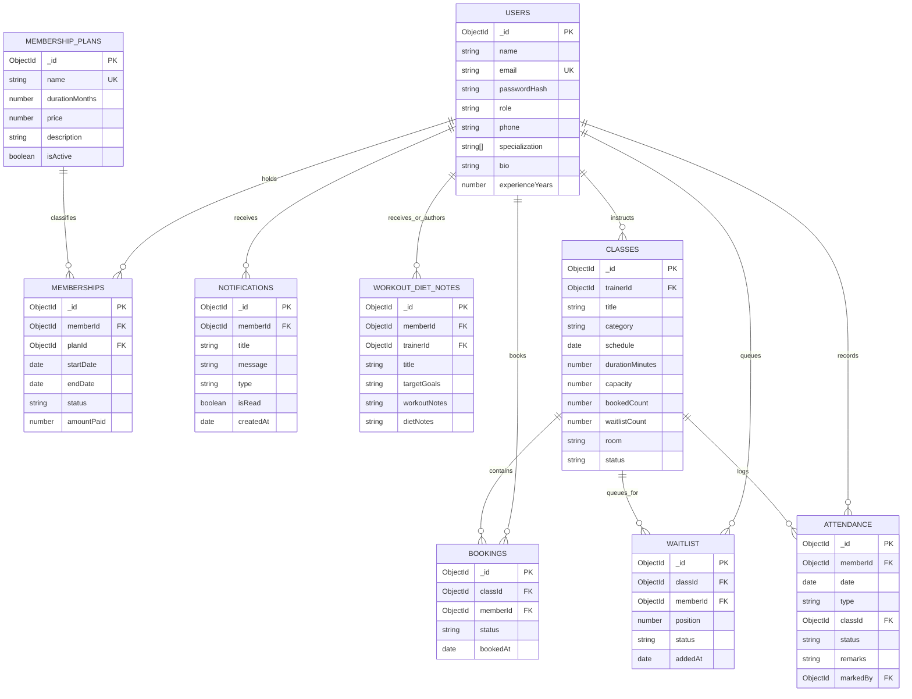

# P18 — Gym & Fitness Membership Management System

**Domain:** Health & Fitness  
**Course:** 5th Semester • Christ University • CIA-3 Project Development  
**L&T EduTech Confidential – Christ University Academic Use Only**

---

## 1. Team Details (First Page Submission)

| Sl. No. | Student Name | Register No. | Department | Section | Assigned Ownership & Responsibilities |
|:-------:|:-------------|:------------:|:-----------|:-------:|:---------------------------------------|
| **1** | **Albert** | 2247101 | Computer Science & Engineering | 5-B | **Sprint 1 Lead:** Member Auth & Reg (M1), Membership Plan Management (M2), Purchase & Expiry Tracking (M3), Trainer Profiles (M4) |
| **2** | **Alan** | 2247102 | Computer Science & Engineering | 5-B | **Sprint 2 Lead:** Class Schedule Management (M5), Class Booking Engine (M6), Attendance Check-Ins (M7), Waitlist Queue Engine (M8) |
| **3** | **Akhil** | 2247103 | Computer Science & Engineering | 5-B | **Sprint 3 Lead:** Diet/Workout Notes (M9), Renewal & Expiry Scanner (M10), Member Self-Service (M11), Branch Admin BI Reports (M12) |
| **4** | **Akash** | 2247104 | Computer Science & Engineering | 5-B | **Architecture & QA Lead:** RBAC Security (M13), Database Modeling, Automated Integration Tests (28/28), UI & Postman Collection |

---

## 2. Problem Statement
Commercial gym facilities often struggle with fragmented, manual register-based tracking across multiple branches. This leads to scheduling bottlenecks, overbooking in popular fitness sessions, lost renewal revenue from untracked expiries, and a lack of consolidated business intelligence for branch managers. The **PulseFit Gym & Fitness Management System** solves this by providing a unified, multi-branch backend supporting member authentication, tier-based membership plans, dynamic class capacity enforcement with automated waitlist promotions, barcode/roster attendance check-ins, and actionable managerial analytics.

---

## 3. Technology Stack

- **Runtime Environment:** Node.js (v18+)
- **Backend Framework:** Express.js (v4.19+)
- **Database & ODM:** MongoDB with Mongoose (v8.5+)
- **Zero-Setup Fallback:** `mongodb-memory-server` (runs immediately out-of-the-box without requiring local MongoDB daemon)
- **Authentication & Security:** JSON Web Tokens (`jsonwebtoken`) & `bcryptjs` password hashing
- **Validation Middleware:** `express-validator`
- **Frontend & UI (Live Demo):** Modern HTML5, Responsive CSS3, Bootstrap 5, FontAwesome 6, Chart.js
- **API Testing:** Automated End-to-End Test Suite (`tests/api.test.js`) & Postman Collection v2.1.0

---

## 4. Setup & Running Instructions

### Step 1: Clone or Navigate to Project
```bash
cd gym-fitness-management
```

### Step 2: Install Dependencies
```bash
npm install
```

### Step 3: Configure Environment Variables (`.env`)
A pre-configured `.env` and `.env.example` are included. By default, the system automatically attempts connection to `mongodb://localhost:27017/gym_fitness_db`. If an external MongoDB instance is not reachable, it automatically spins up an in-process MongoDB instance via `mongodb-memory-server`.
```env
PORT=5000
NODE_ENV=development
MONGO_URI=mongodb://localhost:27017/gym_fitness_db
JWT_SECRET=gym_super_secret_jwt_key_christ_university_2026
JWT_EXPIRES_IN=7d
```

### Step 4: Seed Database with Demo Accounts & Realistic Data
```bash
npm run seed
```
*Seeds Admin, 3 Trainers, 4 Members, 4 Membership Plans, Scheduled Classes, Full Classes with Waitlist, Past Attendance Logs, and Nutrition Plans.*

### Step 5: Start the Server
```bash
npm start
```
The application will be live at:
- **Interactive Web Portal:** `http://localhost:5000`
- **API Base URL:** `http://localhost:5000/api`
- **Health Check:** `http://localhost:5000/api/health`

### Step 6: Run Automated Integration Tests (28 Test Assertions)
```bash
npm test
```

---

## 5. Seeded Demo Accounts (1-Click Switch in UI)

| Role | Email Address | Password | Profile Description |
|:-----|:--------------|:---------|:--------------------|
| **Branch Admin** | `admin@gymfitness.com` | `Admin@123` | Branch Operations, Reports & Analytics |
| **Trainer (HIIT)** | `sarah.trainer@gymfitness.com` | `Trainer@123` | HIIT & Conditioning Specialist |
| **Trainer (Powerlifting)**| `david.trainer@gymfitness.com` | `Trainer@123` | Strength & Hypertrophy Coach |
| **Member (Active)** | `alex.member@gymfitness.com` | `Member@123` | Annual Platinum VIP Member |
| **Member (Expiring)**| `michael.scott@gymfitness.com`| `Member@123` | 3 Days Remaining (Tests Renewal Scan) |

---

## 6. List of Implemented Functional Modules (All 13 Required)

| # | Module | Status | Business Rules & Implementation |
|---|--------|:------:|----------------------------------|
| **1** | **Member Registration & Authentication** | ✅ Implemented | Salt rounds = 10 bcrypt hashing, JWT token issuance, duplicate email rejection (409). |
| **2** | **Membership Plan Management** | ✅ Implemented | Admin creates and manages duration and pricing tiers (Silver, Gold, Platinum, Monthly). |
| **3** | **Membership Purchase & Expiry Tracking** | ✅ Implemented | Calculates end date (`startDate + durationMonths`), enforces active status, handles renewals. |
| **4** | **Trainer Profile Management** | ✅ Implemented | Bio, specialization tags, years of experience, and assigned class schedule. |
| **5** | **Class Schedule Management** | ✅ Implemented | Trainers and admins schedule classes with capacity limits, studio room, and duration. |
| **6** | **Class Booking Engine** | ✅ Implemented | Validates active membership, prevents double booking (409), checks capacity limits. |
| **7** | **Attendance Check-In Module** | ✅ Implemented | Records member check-in for gym visits and booked classes; supports status approval & remarks. |
| **8** | **Waitlist for Full Classes** | ✅ Implemented | Queues members when class capacity is reached; auto-promotes waitlisted members upon cancellation. |
| **9** | **Diet / Workout Plan Notes** | ✅ Implemented | Trainers prescribe personalized workout splits and nutrition guidelines for members. |
| **10**| **Renewal & Expiry Notifications** | ✅ Implemented | Scans memberships expiring within 7 days; generates automated in-app renewal reminders. |
| **11**| **Member Self-Service Dashboard** | ✅ Implemented | Centralized member portal: active plan status, days left, booked classes, attendance, notes. |
| **12**| **Branch Admin Reports** | ✅ Implemented | Real-time BI reports: attendance trends, plan popularity, renewal rates, and gross revenue. |
| **13**| **Role-Based Access Control (RBAC)** | ✅ Implemented | Strict middleware (`authorizeRoles`) enforcing distinct permissions for Member, Trainer, Admin. |

---

## 7. MongoDB Collections & Database Design

### Entity Relationship Diagram (Mermaid)



### Data Modeling Rationale: Referencing vs. Embedding
- **Referencing (Used for Memberships, Classes, Bookings, Attendance):** These documents grow indefinitely over time and are queried independently by members, trainers, and admins. Embedding them into the user document would quickly exceed the 16MB BSON document limit and cause severe write contention.
- **Embedding (Used for Trainer Specializations, Plan Features):** Arrays of strings representing bounded attributes (e.g. features inside a plan) are embedded directly to ensure single-document retrieval speed and eliminate needless joins.

### Suggested Indexes (Implemented)
- `users { email: 1 }` (Unique constraint and $O(1)$ login lookups)
- `membershipPlans { name: 1 }` (Speeds up status-based and name filtering)
- `memberships { memberId: 1, status: 1 }` (Fast relational lookups for active membership verification)
- `classes { trainerId: 1, schedule: 1 }` (Optimizes trainer schedule lookups)
- `bookings { classId: 1, memberId: 1 }` (Prevents duplicate booking conflicts)
- `attendance { memberId: 1, date: -1 }` (Instant member check-in history sorting)

---

## 8. Complete API Endpoint Reference

### Authentication & Profiles (`/api/auth`)
| Method | Endpoint | Access | Description |
|:-------|:---------|:------:|:------------|
| `POST` | `/api/auth/register` | Public | Register a new member |
| `POST` | `/api/auth/login` | Public | Authenticate user and issue JWT token |
| `GET`  | `/api/auth/me` | Authenticated | Retrieve current user profile |
| `PUT`  | `/api/auth/profile` | Authenticated | Update profile details |

### Membership Plans (`/api/plans`)
| Method | Endpoint | Access | Description |
|:-------|:---------|:------:|:------------|
| `GET`  | `/api/plans` | Public | Retrieve active membership plans |
| `GET`  | `/api/plans/:id` | Public | Retrieve plan details |
| `POST` | `/api/plans` | Branch Admin | Define a new membership plan |
| `PUT`  | `/api/plans/:id` | Branch Admin | Modify plan duration, pricing, or status |
| `DELETE`| `/api/plans/:id` | Branch Admin | Deactivate a membership plan |

### Membership Purchases & Expiry Tracking (`/api/memberships`)
| Method | Endpoint | Access | Description |
|:-------|:---------|:------:|:------------|
| `POST` | `/api/memberships` | Member | Purchase a membership plan (Prompt Sample Endpoint) |
| `GET`  | `/api/memberships/my` | Member | Retrieve member active membership & history |
| `GET`  | `/api/memberships` | Branch Admin | Query all branch memberships |
| `PUT`  | `/api/memberships/:id/cancel` | Member/Admin | Cancel an existing membership |
| `POST` | `/api/memberships/check-expiries`| Branch Admin | Scan and transition expired memberships |

### Trainer Profiles (`/api/trainers`)
| Method | Endpoint | Access | Description |
|:-------|:---------|:------:|:------------|
| `GET`  | `/api/trainers` | Public | List all certified trainers & specializations |
| `GET`  | `/api/trainers/:id` | Public | Get trainer bio and upcoming classes |
| `POST` | `/api/trainers` | Branch Admin | Onboard new trainer |
| `PUT`  | `/api/trainers/:id` | Trainer/Admin | Update bio, specializations, and experience |

### Class Schedule Management (`/api/classes`)
| Method | Endpoint | Access | Description |
|:-------|:---------|:------:|:------------|
| `GET`  | `/api/classes` | Public | View scheduled classes with filter |
| `POST` | `/api/classes` | Trainer/Admin | Create class session with capacity |
| `GET`  | `/api/classes/:id` | Public | Get class details and roster |
| `PUT`  | `/api/classes/:id` | Trainer/Admin | Update class schedule or room |
| `DELETE`| `/api/classes/:id` | Trainer/Admin | Cancel class and notify members |
| `GET`  | `/api/classes/trainer/my-schedule`| Trainer | Get assigned classes schedule |

### Class Booking Engine (`/api/classes/:id/book` & `/api/bookings`)
| Method | Endpoint | Access | Description |
|:-------|:---------|:------:|:------------|
| `POST` | `/api/classes/:id/book` | Member | Book slot in class (Prompt Sample Endpoint) |
| `GET`  | `/api/bookings/my` | Member | View member upcoming class bookings |
| `DELETE`| `/api/bookings/:id/cancel` | Member/Admin | Cancel booking and trigger waitlist promotion |

### Attendance Check-In (`/api/attendance`)
| Method | Endpoint | Access | Description |
|:-------|:---------|:------:|:------------|
| `POST` | `/api/attendance/checkin` | Authenticated | Record check-in for gym/class (Prompt Sample) |
| `GET`  | `/api/attendance/my` | Member | View personal gym attendance history |
| `GET`  | `/api/attendance` | Trainer/Admin | View branch-wide attendance records |
| `PUT`  | `/api/attendance/:id/status` | Trainer/Admin | Review and update remarks/status |

### Waitlist for Full Classes (`/api/classes/:id/waitlist` & `/api/waitlist`)
| Method | Endpoint | Access | Description |
|:-------|:---------|:------:|:------------|
| `POST` | `/api/classes/:id/waitlist` | Member | Join waitlist when class is at capacity |
| `GET`  | `/api/classes/:id/waitlist` | Trainer/Admin | View waitlisted roster for a class |
| `GET`  | `/api/waitlist/my` | Member | View member active waitlist spots |
| `DELETE`| `/api/waitlist/:id` | Member | Withdraw from waitlist |

### Diet & Workout Plan Notes (`/api/workout-diet`)
| Method | Endpoint | Access | Description |
|:-------|:---------|:------:|:------------|
| `POST` | `/api/workout-diet` | Trainer/Admin | Log personalized workout/diet notes |
| `GET`  | `/api/workout-diet/my` | Member | View personalized notes from trainer |
| `GET`  | `/api/workout-diet/member/:memberId`| Trainer/Admin | View notes for specific member |
| `PUT`  | `/api/workout-diet/:id` | Trainer/Admin | Update workout/diet prescription |

### Notifications & Renewal Reminders (`/api/notifications`)
| Method | Endpoint | Access | Description |
|:-------|:---------|:------:|:------------|
| `GET`  | `/api/notifications/my` | Member | View reminders and notifications |
| `PUT`  | `/api/notifications/:id/read` | Member | Mark single notification as read |
| `PUT`  | `/api/notifications/read-all` | Member | Mark all notifications read |
| `POST` | `/api/notifications/generate-renewal-reminders`| Admin | Generate reminders for expiries <= 7 days |

### Dashboards (`/api/dashboard`)
| Method | Endpoint | Access | Description |
|:-------|:---------|:------:|:------------|
| `GET`  | `/api/dashboard/member` | Member | Member self-service dashboard summary |
| `GET`  | `/api/dashboard/trainer`| Trainer | Trainer schedule & student stats |
| `GET`  | `/api/dashboard/admin`  | Branch Admin | Branch KPIs and operations overview |

### Branch Admin Reports (`/api/admin/reports`)
| Method | Endpoint | Access | Description |
|:-------|:---------|:------:|:------------|
| `GET`  | `/api/admin/reports/attendance` | Branch Admin | Daily attendance trends & peak hours |
| `GET`  | `/api/admin/reports/plans` | Branch Admin | Membership plan popularity & revenue |
| `GET`  | `/api/admin/reports/renewals` | Branch Admin | Member retention & renewal rate % |
| `GET`  | `/api/admin/reports/overview` | Branch Admin | Full business intelligence overview |

---

## 9. Sample Request & Response Payloads

### 1. Purchase Membership Plan (`POST /api/memberships`)
**Request Body:**
```json
{
  "name": "Quarterly Silver",
  "durationMonths": 3,
  "price": 129.00
}
```
**Success Response (201 Created):**
```json
{
  "success": true,
  "message": "Record created successfully",
  "data": {
    "_id": "64f1a2b3c4d5e6f7a8b9c0d1",
    "plan": "Quarterly Silver",
    "startDate": "2026-09-10T09:15:00.000Z",
    "endDate": "2026-12-10T09:15:00.000Z",
    "amountPaid": 129.00,
    "status": "active"
  }
}
```

### 2. Record Attendance Check-In (`POST /api/attendance/checkin`)
**Request Body:**
```json
{
  "type": "gym",
  "status": "Approved",
  "remarks": "Reviewed and confirmed by authorized role"
}
```
**Success Response (200 OK):**
```json
{
  "success": true,
  "message": "Status updated successfully",
  "data": {
    "_id": "64f1a2b3c4d5e6f7a8b9c0d2",
    "status": "Approved",
    "type": "gym",
    "remarks": "Reviewed and confirmed by authorized role"
  }
}
```

### 3. Error Response (Validation / Business Conflict)
**Error Response (400 / 409):**
```json
{
  "success": false,
  "message": "Class is at maximum capacity. You can join the waitlist instead.",
  "errorCode": "CLASS_FULL"
}
```

---

## 10. Role-Based Access Control (RBAC) Matrix

| Feature / Resource | Member | Trainer | Branch Admin |
|:-------------------|:------:|:-------:|:------------:|
| Register / Login | ✅ | ✅ | ✅ |
| View Public Plans & Classes | ✅ | ✅ | ✅ |
| Purchase / Renew Membership | ✅ | ❌ | ✅ |
| Book Class Slot | ✅ (Active plan required) | ❌ | ❌ |
| Join Class Waitlist | ✅ | ❌ | ❌ |
| Check-in for Gym Visit | ✅ | ✅ | ✅ |
| Create / Edit Classes | ❌ | ✅ | ✅ |
| Cancel Classes | ❌ | ✅ (Assigned) | ✅ (All) |
| Log Workout / Diet Notes | ❌ | ✅ | ✅ |
| View Assigned Notes | ✅ | ✅ | ✅ |
| Create / Deactivate Plans | ❌ | ❌ | ✅ |
| Manage Trainer Profiles | ❌ | ✅ (Self) | ✅ (All) |
| View Branch BI Reports | ❌ | ❌ | ✅ |
| Trigger Renewal Expiry Scan| ❌ | ❌ | ✅ |

---

## 11. Known Limitations & Boundaries

1. **Third-Party Payment Gateways:** In accordance with the project specification boundaries, third-party payment gateways (e.g. Stripe, Razorpay) are stubbed with automated internal transaction references (`TXN-XXXXXX`).
2. **SMS/Email Notifications:** Push and email providers are mocked; in-app notification records are generated and delivered to the member dashboard and bell notification drawer.
3. **Single Currency & Time Zone:** Calculations assume standard USD ($) and local branch system timezone.

---

## 12. Viva Preparation & Architecture Guide

1. **How is capacity overflow and waitlist promotion handled?**  
   When a member books a class via `POST /api/classes/:id/book`, the system checks `bookedCount < capacity`. If full, it rejects with `CLASS_FULL (409)` and directs them to the waitlist. When any member cancels their booking via `DELETE /api/bookings/:id/cancel`, the controller searches the `Waitlist` collection for the next member with `status: 'waiting'`, atomically promotes them to `promoted`, creates a `Booking` record for them, decrements the waitlist counter, and fires a real-time promotion notification.
2. **How is expiry tracking managed?**  
   Memberships store an explicit `endDate` computed at purchase time. The `/api/notifications/generate-renewal-reminders` endpoint scans for memberships where `endDate <= now + 7 days` and delivers reminder notices. The `/api/memberships/check-expiries` endpoint automatically flips status from `active` to `expired`.
3. **Why use referencing instead of embedding for memberships and bookings?**  
   Gym members accumulate dozens of bookings and annual renewals. If embedded into a single `User` document, the array would grow unboundedly, slowing down lookups and risking MongoDB's 16MB document cap. Referencing via ObjectIds allows indexing by relation (`{ memberId: 1 }`, `{ classId: 1 }`) for optimal query performance.
